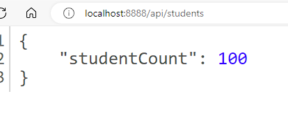

# PresentationRestCodeExamplewithServlet
This is an example of an API created with Javaee8 and Servlet.
In this simple example an endpoint /api/students can be used to return Json data representing students
# Json data recieved

